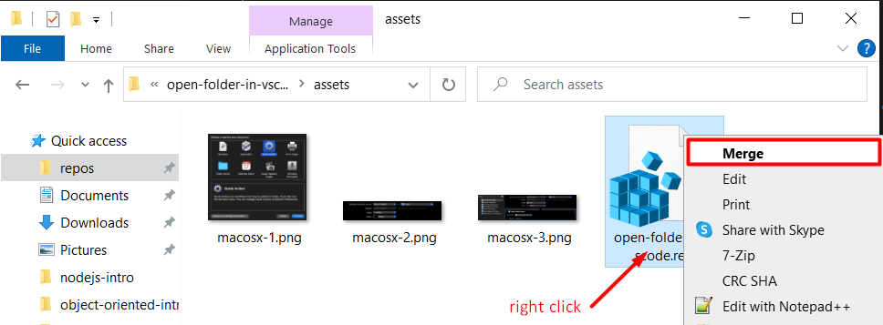
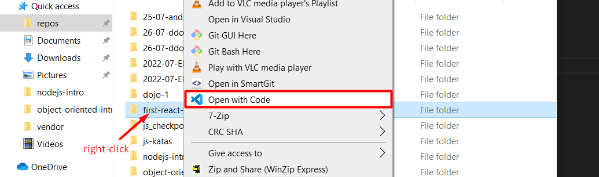
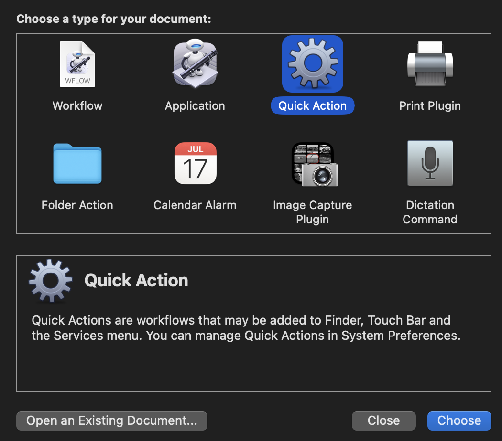
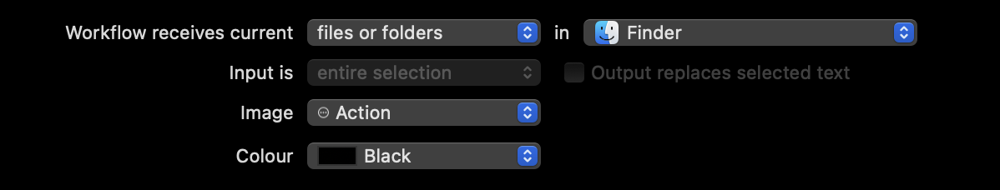
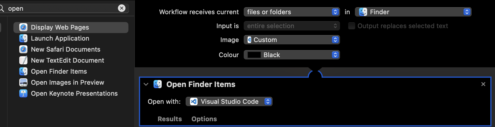

# Open Folders in Visual Studio Code

Often, beginners struggle when opening folders in Vscode. For one, the idea of opening a 'folder' might seem unintuitive to those used only to opening files.

As it turns out, there is a way to open folders by right clicking on them in Windows and Mac OS X. Read below for more!

## Windows 10/11 (i.e. Windows Explorer)

In order to open folders in Vscode by right clicking, you will have to download and merge the registry file [linked here](./assets/open-folder-in-vscode.reg), as shown below.

Note that the action above requires elevated privileges.

Once merged, any folder can be opened in Vscode from the context menu as shown below.

## Mac OS X (i.e. Finder)

This text is quoted from the second answer in this [_stack overflow_ article](https://stackoverflow.com/questions/64040393/open-a-folder-in-vscode-through-finder-in-macos).

The simplest solution is to create a **Quick Action** with **Open Finder Items**: This way you don't need a shell script that might break with an OS update or Vscode update.

1. **Launch Automator** and select Quick Action or File > New > Quick Action If Automator is already open.

2. Set Quick Action receives selected to **files or folders** and in to **Finder**.

3. Choose an Image (icon) select Choose.. and double click Visual Studio Code in the window that pops up, this will set your quick action icon to the same as VS Code.
4. Add **Open Finder Items**, Choose open with as **Other..** select **Visual Studio Code** and save your Quick Action as Open in VSCode optionally choose an Image for your Quick Action job done.

## Comments? Suggestions?

